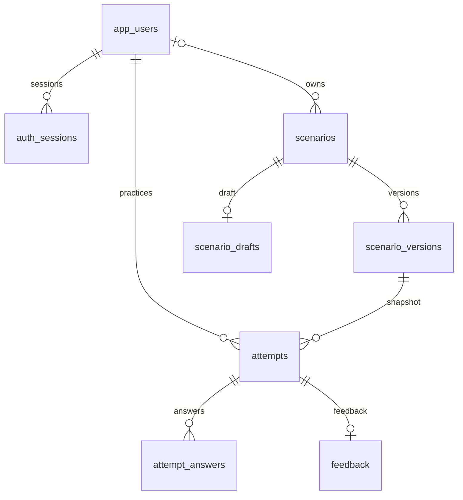

# Модель PostgreSQL

## Решение

Схема гибридная. Пользователи, сессии, сценарии, версии, попытки, ответы и отзывы — отдельные связанные таблицы. Полное описание графа диалога хранится как `jsonb` внутри **неизменяемой версии**. Его структура соответствует каноническому `MakerDefinition` (`schemaVersion: 3`); персонажи, этапы, реакции, evaluation, варианты реплик и концовки не теряются.

Граф публикуется и загружается целиком, поэтому хранение одного документа на версию сохраняет текущую архитектуру без сборки сценария из десятков запросов. История действий, права и связи с пользователем остаются реляционными. JSON проверяется схемой Zod; перед публикацией `compileScenario` дополнительно проверяет переходы, уникальность ID, персонажей, этапы, отсутствие циклов, достижимость вопросов и концовку провала.

Сведения о JSONB: [документация PostgreSQL](https://www.postgresql.org/docs/current/datatype-json.html). Все команды транзакции выполняются на одном соединении, как требует [node-postgres](https://node-postgres.com/features/transactions).

## Таблицы

| Таблица             | Что хранит                                                                      | Основные связи и ограничения                                                                      |
| ------------------- | ------------------------------------------------------------------------------- | ------------------------------------------------------------------------------------------------- |
| `app_users`         | UUID, имя, email, хеш пароля, даты создания/изменения                           | Email приводится к нижнему регистру и уникален                                                    |
| `auth_sessions`     | Хеш токена, пользователь, срок действия                                         | Сессия принадлежит одному пользователю; токен в базе не хранится открытым текстом                 |
| `scenarios`         | Стабильный ID, владелец, опубликованная версия, архивирование                   | Исходные сценарии имеют `owner_id = NULL`; пользователь работает со своей копией                  |
| `scenario_versions` | Номер версии, карточка `preview`, полный граф `definition`, дата публикации     | PK `(scenario_id, version)`; опубликованные записи нельзя обновлять или удалять через обычный DML |
| `scenario_drafts`   | Личный черновик, номер редакции, дата изменения                                 | Один черновик на сценарий; `revision` предотвращает потерю правок в двух вкладках                 |
| `attempts`          | Пользователь, версия сценария, состояние, текущий вопрос/концовка, штрафы, даты | FK на конкретную версию; только одна текущая попытка пользователя на сценарий                     |
| `attempt_answers`   | Порядок, ID вопроса/ответа, время подтверждения                                 | PK `(attempt_id, sequence)`; один вопрос нельзя записать дважды в одной попытке                   |
| `feedback`          | Полезность, комментарий, даты создания/изменения                                | Один редактируемый отзыв на попытку; API разрешает его только владельцу завершённой попытки       |
| `schema_migrations` | Применённые миграции и SHA-256                                                  | Записанную миграцию нельзя тихо изменить: загрузчик обнаружит несовпадение                        |



## Соответствие текущей модели TypeScript

| Тип / поле | Представление в PostgreSQL |
| --- | --- |
| `MakerDefinition` | `scenario_versions.definition` и `scenario_drafts.definition`, `jsonb` |
| `ScenarioMetadata` | `definition.metadata`; ID и версия дополнительно зафиксированы ключами версии |
| `Character` | `definition.characters`; реплика ссылается через `characterId` |
| Этап | `definition.stages`; реплика ссылается через необязательный `stageId` |
| Реплика | `definition.nodes`, включая `textVariants` |
| `UserReaction` | `definition.nodes[].reactions`; содержит `intent`, `examples`, `evaluation` и переход |
| `ReactionEvaluation` | `reaction.penalty / reaction.feedback` |
| Переход | ровно один из `nextNodeId` или `endingId` |
| Финал | `definition.endings` (`success / neutral / failure`) |
| `ScenarioPreview` | `scenario_versions.preview`; только данные каталога/карточки, не исполняемая логика |
| `ScenarioAttempt` | `attempts` + упорядоченные `attempt_answers` |
| `Feedback` | таблица `feedback` |

Старые структуры `speakerId / answers / next`, `preview.dialogue` и `reaction.legacy` не являются рабочей схемой БД. Они принимаются compatibility-parser только при чтении старых данных и преобразуются в `MakerDefinition`.

### Нормализация старых документов

```bash
npm run db:normalize-scenarios
```

Команда обновляет только JSON-представление старых сценариев и черновиков. Для `scenario_versions` она временно отключает пользовательский trigger неизменяемости внутри одной транзакции, сохраняет те же `(scenario_id, version)`, затем включает trigger обратно. Если транзакция падает, PostgreSQL откатывает и данные, и состояние trigger. Уже канонические JSON не переписываются.

## SQL-типы

- `uuid` — идентификаторы аккаунта и попытки. Генерируются сервером через `crypto.randomUUID()`.
- `text` — имена, email, идентификаторы графа, комментарии, хеши; длина ограничивается там, где это необходимо.
- `integer` — версия, редакция, номер ответа, штрафы. В SQL есть ограничения на диапазон/знак.
- `boolean` — полезность отзыва и признак текущей попытки.
- `timestamptz` — все даты. API возвращает ISO 8601, UI отображает локальное время пользователя.
- `jsonb` — структурированные документы сценариев. Запросы к вложенным полям возможны средствами PostgreSQL.
- Статусы попыток хранятся как `text` с `CHECK`, а не PostgreSQL ENUM, чтобы новые статусы можно было вводить обычной миграцией. В TypeScript сохранён discriminated union.

Незавершённая попытка при перезапуске получает `abandoned_at` и `is_current=false`. Её `status` остаётся `in-progress`, что сохраняет совместимость с исходным движком; интерфейс истории отображает «Прервана». Завершённая старая попытка остаётся `completed`.

## Запись одного ответа

1. Авторизация проверяет сессию; ID пользователя берётся из неё.
2. Сервер выбирает попытку по её ID **и владельцу**, блокирует строку `FOR UPDATE`.
3. Проверяются текущий вопрос, ожидаемое число ответов и принадлежность ответа этому вопросу.
4. По сохранённой версии сценария движок рассчитывает переход, штраф и возможную концовку. Клиент отправляет только `nodeId`, `answerId`, `expectedAnswers`.
5. В одной транзакции добавляется строка истории и обновляется попытка.
6. Ответ API приходит после `COMMIT`. Ошибка записи не переводит интерфейс к следующему вопросу.

Повтор того же уже подтверждённого ответа возвращает сохранённое состояние. Другой ответ на уже обработанный вопрос даёт 409. Просмотр попытки и её истории выполняется в согласованном снимке `REPEATABLE READ`.

Оценка не переписана: порог провала — половина всех вопросов графа с округлением вверх. В `terms` 11 вопросов, порог 6; длина отдельного пути может быть 4 ответа. Условный характер исходных штрафов сохранён. Проценты 0–100 и «активное время обучения» из них не выдумываются.

## Полезные SQL-запросы

```sql
-- Опубликованные сценарии.
SELECT s.id, s.published_version, v.preview->>'title' AS title
FROM scenarios s
JOIN scenario_versions v
  ON v.scenario_id = s.id AND v.version = s.published_version
WHERE s.archived_at IS NULL;

-- Все вопросы конкретной опубликованной версии.
SELECT n->>'id' AS node_id, n->>'title' AS title, n->>'text' AS speech
FROM scenario_versions v,
LATERAL jsonb_array_elements(v.definition->'nodes') n
WHERE v.scenario_id = 'terms' AND v.version = 1;

-- История попыток с названиями соответствующих версий.
SELECT a.id, u.email, v.preview->>'title' AS title,
       a.scenario_version, a.status, a.penalties, a.started_at
FROM attempts a
JOIN app_users u ON u.id = a.user_id
JOIN scenario_versions v
  ON v.scenario_id = a.scenario_id AND v.version = a.scenario_version
ORDER BY a.started_at DESC;

-- Периодическая уборка истёкших сессий.
DELETE FROM auth_sessions WHERE expires_at <= now();
```

Сбор отзывов и допустимость конкретного ответа обеспечиваются API, а не SQL-триггерами поверх JSON. При ручном изменении таблиц через psql необходимо соблюдать эти же правила. Приложение не принимает от браузера готовые штрафы, результат или ID владельца.

## Что добавлено к исходной модели

`User`, серверная сессия, владелец сценария, опубликованная версия, черновик с редакцией, архивирование, признак текущей попытки и отметка прерывания. Это необходимые сущности для реального хранения и нескольких аккаунтов.

## Предложения по следующим типам данных

| Тип                               | Что хранить                                               | Зачем / когда добавлять                                                                           |
| --------------------------------- | --------------------------------------------------------- | ------------------------------------------------------------------------------------------------- |
| `Category` и `Skill`              | ID, название, описание; связи со сценариями               | Устранить дубли вроде разных написаний одного навыка и строить прогресс по навыкам                |
| `AssessmentCriterion`             | Навык, вес, шкала, объяснение оценки и версия правил      | Нужен для содержательной оценки обучения; текущие штрафы из архива условные                       |
| `UserRole` / `ScenarioPermission` | Участник, автор, модератор; права на конкретный сценарий  | Если публиковать должны не все зарегистрированные пользователи или над сценарием работает команда |
| `AuditEvent`                      | Кто, когда, какую сущность изменил; тип действия и версия | Для разбора изменений редактора и административных операций                                       |
| `PracticeActivity`                | Подтверждённые интервалы активности, активные секунды     | Для честного показателя времени практики; разность начала и завершения включает паузы             |
| `NegotiationMessage`              | Роль отправителя, текст, время, привязка к попытке        | При добавлении свободного текстового/ИИ-диалога, которого в этом архиве пока нет                  |

Эти расширения предложены, но не включены как пустые таблицы без работающей логики.

## Роли пользователей

В `app_users.role` поддерживаются две роли: `user` и `admin`. Новые аккаунты получают роль `user` автоматически.
Редактор сценариев доступен только администраторам. Для локальной разработки существующий аккаунт можно повысить вручную:

```sql
UPDATE app_users SET role = 'admin' WHERE email = 'admin@example.com';
```

> Важно: роль добавлена прямо в `001_initial.sql`. Если эта миграция уже применялась к существующей базе, её checksum изменится. Для текущей хакатонной схемы проще пересоздать локальную БД и снова выполнить `npm run db:setup`.

## Дополнение 0.4.0: данные maker

Миграция `002_scenario_editor.sql` добавляет `scenario_drafts.editor jsonb NOT NULL DEFAULT '{"positions":{}}'`. Поле хранит только позиции карточек и необязательный viewport. Оно обновляется в той же транзакции, что и черновик, с прежней проверкой revision.

`scenario_drafts.definition` и `scenario_versions.definition` принимают legacy-формат или текущий v3 с `schemaVersion: 3`, `nodes[].reactions`, `intent` и `examples`. Сохранение через maker переводит текущий черновик в v3; ранее опубликованные записи не мигрируются. SQL-таблицы попыток и ответов не меняются: `answer_id` соответствует стабильному `reaction.id`.

Координаты не включаются в опубликованные версии. Для существующего приложения достаточно `npm run db:migrate`; удалять или пересоздавать таблицы не нужно. Общая миграция 001 оставлена без изменений.

## Docker, постоянное хранение и резервные копии

Основной `compose.yaml` запускает два постоянных сервиса: `app` и PostgreSQL 17. База не публикует порт на хост по умолчанию и доступна приложению внутри сети Docker. Данные PostgreSQL лежат в именованном томе `cool_peppers_postgres`, поэтому `docker compose down` и пересборка контейнера не удаляют их.

Контейнер приложения при старте выполняет `db:migrate`, затем идемпотентный `db:seed`, после чего запускает HTTP-сервер. В Docker соединение задаётся стандартными переменными `PGHOST/PGPORT/PGDATABASE/PGUSER/PGPASSWORD`; локальный режим с `DATABASE_URL` сохранён.

Для резервных копий используются одноразовые сервисы `backup` и `restore` на том же образе PostgreSQL, что и сервер базы. `backup` выполняет `pg_dump --format=custom`; файлы записываются через bind mount прямо в `./backups` на хосте. Рядом создаётся SHA-256 checksum. `restore` сначала проверяет checksum (если он есть), завершает существующие соединения с целевой БД и выполняет `pg_restore --clean --if-exists --single-transaction --exit-on-error`.

Рекомендуемый цикл:

```powershell
docker compose run --rm backup
npm run docker:backups
npm run docker:restore -- latest
```

При ручном восстановлении сначала остановите `app`. Node-обёртка `docker:restore` делает это автоматически и запускает приложение только после успешного `pg_restore`.

Важно: `docker compose down -v` удаляет именованный том и вместе с ним текущую БД. Перед этой командой создайте бэкап, если данные нужны.
